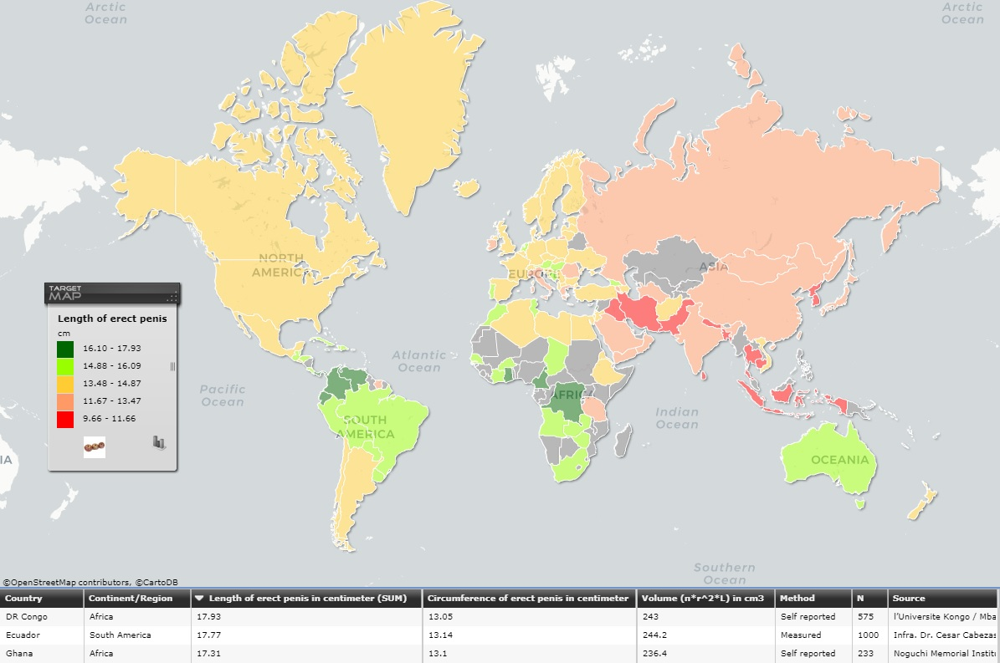

# 你的丁丁到底有多长？

废话不多，先上图，看下按国家为单位的全球丁丁唤醒长度分布，深绿为优秀、黄色为及格、红色是男人深深的自卑，数据来源于一个[神奇的统计网站](https://www.targetmap.com/viewer.aspx?reportId=3073
)，大部分存在感强的国家的数据都有。


## 测量方法

## 丁丁的平均size究竟是多少？

## 不同种族和地区的丁丁是不是真的不一样大？

## 从一个男人的鼻子就能看出来他的size？

## 妹子是不是都爱大丁丁？

## 丁丁怎么变大？

## 总结

再复习一遍全球男性丁丁的平均值：长度13.1cm，周长11.6cm，记好这个数字。

那么先来看看我大天朝男人的平均丁丁长度是多少呢：长12.9cm，周长11.14cm。

所以不要痴人说梦，180mm一般情况下都是天赋异秉！

量量你的丁丁到底有多长！


### Markdown

Markdown is a lightweight and easy-to-use syntax for styling your writing. It includes conventions for

```markdown
Syntax highlighted code block

# Header 1
## Header 2
### Header 3

- Bulleted
- List

1. Numbered
2. List

**Bold** and _Italic_ and `Code` text

[Link](url) and 
```

For more details see [GitHub Flavored Markdown](https://guides.github.com/features/mastering-markdown/).

### Jekyll Themes

Your Pages site will use the layout and styles from the Jekyll theme you have selected in your [repository settings](https://github.com/jb180mm/jb180mm/settings). The name of this theme is saved in the Jekyll `_config.yml` configuration file.

### Support or Contact

Having trouble with Pages? Check out our [documentation](https://help.github.com/categories/github-pages-basics/) or [contact support](https://github.com/contact) and we’ll help you sort it out.
