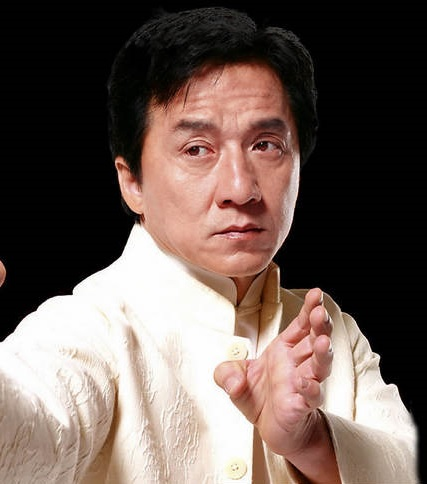

# 你的丁丁到底有多长？

    月亮代表我的心，你到底爱我有多深？

    村里有个姑娘叫小芳，你的丁丁到底有多长？

废话不多，先上图，看下按国家为单位的全球丁丁唤醒长度分布，深绿为优秀、黄色为及格、红色是男人深深的自卑，数据来源于一个[神奇的统计网站](https://www.targetmap.com/viewer.aspx?reportId=3073
)（需要开启flash），大部分存在感强的国家的数据都有。

先看下数据

- 长度第一名 刚果，平均长度达17.93cm （中国12.9cm）

- 周长第一名 法国，平均周长达13.63cm （中国11.14cm，看来中国人平均粗壮程度还可以，没有像长度一样差距1/3）

- 体积第一名 厄瓜多尔，平均有**244.2^3cm这么好大一坨** （中国127.4^3cm）

## 测量方法

评估丁丁长度是否正常，最好是测唤醒时的长度，因为每个人勃起程度是不一样的，平常疲软状态下的长度参考意义不大，很多“小牙签”在勃起时真的会完全变一个样呢。疲软状态下丁丁的长度不一定是它的真面目，等它爆发勃起了···

## 丁丁的平均size究竟是多少？

影响丁丁size因素大致为如下几种：

- 遗传因素：丁丁大小长短很大程度上受遗传基因控制与影响，是最根本的影响因素。

- 后天营养与发育：一般来说，营养状况好，身形高大强壮的男性生殖器发育良好，丁丁可能较大较长；反之，则可能较短小。但，目前尚无证据显示，丁丁大小长短与身高成正比关系。

- 身体肥胖：身材偏胖的男性，尤其是下腹会阴部脂肪较多的男士，丁丁部分埋盖在脂肪中，较正常男性来说，丁丁会显得短小。

- 疾病因素：如促性腺素分泌不足、生殖器官受损、睾丸炎、阴囊炎、睾丸发育不全等;

- 心理因素：即患者主观感觉认为，自己丁丁存在对外人来说的明显缺陷，而实际问题并不存在。

**不同种族和地区的丁丁是不是真的不一样大？**

**丁丁到底多粗算粗？传说中一只手握不过来真的有吗？**

## 从一个男人的鼻子就能看出来他的size？

有句被世人默认为真理的话“鼻子大dd大”，但是有不少粉丝反应这是骗那些没驾照与新手上路人的。好多袖珍版的丁丁，也有不少配置大鼻子的人。

有一位粉丝说，有次约了一个大鼻子男，由于受到所谓鼻子大即丁丁大的“真理”影响，激动万分，憧憬满满，可是谁知一出鸟笼，落差太大，性趣全无。

因此我们基本上可以打破这一所谓真理了。

但是，也不能说鼻子与丁丁没有任何的联系。

与各位老司机总结了一下经验。鼻子还是与丁丁大小有一定联系的。首先鼻梁高高鼻子长的男性，丁丁会比较挺拔俊俏，长度是有的。那么周长怎么看，其实和鼻头与鼻翼是有联系的。鼻头丰腴有肉，鼻翼横张且有肉，也就是说鼻子正视图边长长，这样的丁丁周长会比较理想。

## 妹子是不是都爱大丁丁？

据统计，让女人兴奋，唤醒平均需要11-12cm；而如果要做好，可能需要再长1～2cm，也就是13～14cm！

**硬度是关键**

丁丁并不是越大越粗越长就越好，有一句话叫过犹不及。很多女性都反应，尺寸太大会降低快感，甚至会痛。

女人的年龄、身体条件、实操经历各不相同，喜欢的丁丁尺寸都不相同。刚开荤的女人那个比较紧实、生涩，喜欢短小一点的。随着实操的增多，那里的弹性加大，会逐渐喜欢大一点粗一点的。

>充实感！

但是长度不是“重点”，硬度才是“关键”，3 级和4 级都能够完成活塞运动，但是4 级硬度才是最佳硬度。

- 1级丁丁胀大了，但是软塌塌的，类似豆腐; ——最差

- 2级丁丁略硬，但不能工作，类似剥皮的香蕉; ——稍差

- 3级丁丁已经比较硬了，类似带皮的香蕉; ——合格

- 4级丁丁进入完全战斗状态，类似黄瓜; ——棒棒哒

3级和4级状态下都能啪啪啪，但4级状态会更好。

小孩才在乎长短，成人只看硬度和技巧。

>至于长短，重要吗？

**长度不够，颜值来凑**

如果你身怀大器，和妹子的妹妹特别契合，会降低对技巧的需求，随便搞搞就能很爽。大尺寸确实让妹子们觉得男性更有吸引力，而如果小的话确实会降低吸引力。

如果尺寸一般，那就只能用技巧去提高，或者让她自己来找感觉啦。一个男生高或者颜值比较高，那么他下面稍微没那么突出也没关系，如果一个男生矮，最好还是要装备比较牛逼才行。

下图可以看出，长度基本差不多的情况下，肯定是颜值比较高的右图更具吸引力。

## 丁丁怎么变大？

>这一段标题应该写成《怎么样让丁丁重新上路》

有些人还是会问怎么像未央生一样变大，主要是心理自卑在作祟。

**印度神油真的有用吗？**

印度神油指的应该是阿育吠陀油，延时效果是有的，但是效果不稳定，基本体验不到快感！印度神油这玩意儿早年传自香港，不排除是商人的宣传噱头，可能印度人自己都不知道有这玩意儿。

- 为何可以延时？

有些印度神油，有延时药物的成份。可以麻痹阴茎体背部神经，降低性兴奋传递效率，从而实现延时效果。跟一般的延时喷剂、外用涂抹剂原理一致，长期使用一般都有伤害性。

有延时需求的可以看下口服必利劲，类似产品有2H2D黑金版、安太医加强版、享久二代等，据说印度小绿瓶效果明显。请自行分辨。有兴趣的可以看这个[评测](http://www.maiyspj.com)。

>**特别注明：本网页不是药品广告，请遵从药师指导！**

- 可以增大吗？

丁丁增大的关键在于海绵体，成年男性的丁丁发育基本结束，除非像未央生一样接受手术治疗，一般是没戏。

**蓝色小药丸**

有点离题了。

蓝色小药丸药品名：西地那非（伟哥）。由美国辉瑞制药公司在英国肯特郡桑威治的研究中心研发，本是为了用于治疗心血管疾病的5-磷酸二酯酶抑制药而进入临床试验的。

1991年4月，西地那非的临床研究正式宣告失败，但研究员发现，治疗者在领过试药之后都不愿意交出余下的药物。追查之下，发现这一种药对病者的性生活有改善。

在经辉瑞高层许可后，研究人员就西地那非对阴茎海绵体平滑肌的作用展开了研究，并于1998年3月27日获得美国联邦食品和药品管理局的上市许可，之后迅速获得商业上的成功，2008年辉瑞公司借此获利19.34亿美元，成为令该公司名声大噪的一个产品。

然而伟哥不止西地那非这一种，也不只蓝色这一种颜色，还有他达拉非（也就是俗称的希爱力），还有盐酸伐地那非（也就是爱力达）。他达拉非和盐酸伐地那非是黄色小药丸。

能从沉睡💤中唤醒已经很不错了，麻烦你不要和别人比长论短了。

**脱敏治疗**

至于诸多脱敏方法：阴茎背神经阻断术、拍打法、冷热刺激法、药物手术等，问题可能会变得严重，没有了敏感你的快感从哪里来？

**如何延时**

- 规范生活方式，适度体育锻炼

- 语言和行动上的关怀和鼓励，心理暗示很重要

- 做的过程中做好行为指导，做足前戏，把握好节奏

- 刚才提的喷剂可以适度试用

## 总结

再复习一遍全球男性丁丁的平均值：长度13.1cm，周长11.6cm，记好这个数字。

那么先来看看我大天朝男人的平均丁丁长度是多少呢：长12.9cm，周长11.14cm。

所以不要痴人说梦，180mm一般情况下都是天赋异秉！

你的自卑可能很多余！并不是必须要有18cm/180mm的丁丁才能过上性福生活。

最后，量量你的丁丁到底有多长！
